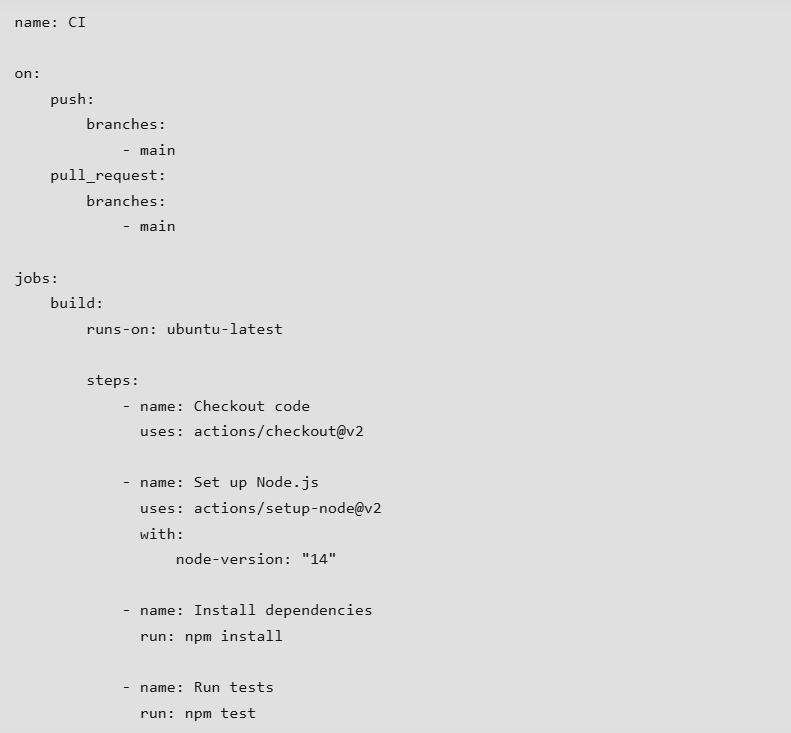

How to Create a GitHub Workflow
Here’s a step-by-step guide to creating a basic GitHub Workflow:

Step 1: Navigate to Your Repository
Go to your GitHub repository where you want to create a workflow.

Step 2: Create the Workflow File
Create a new file in the .github/workflows/ directory of your repository. For example, you might create a file named ci.yml.

Step 3: Define the Workflow
In your new workflow file, define the workflow using YAML syntax. Below is a basic example of a workflow that runs a set of tests whenever code is pushed to the main branch:

Components of GitHub Workflows
Events: These are triggers that start workflows. Common events include:
Push: Triggered when code is pushed to the repository.
Pull Request: Triggered when a pull request is opened, synchronized, or reopened.
Schedule: Triggers workflows at scheduled times using cron syntax.
Jobs: Jobs are sets of steps that run on the same runner. Jobs can run in parallel or can be configured to run sequentially using the needs keyword.
Steps: Steps are individual tasks within a job. Steps can run commands directly or use actions to perform tasks. Actions are reusable units of code that can be used to simplify your workflows.
Runners: These are the servers that run your workflows. GitHub provides hosted runners for various operating systems, including Ubuntu, Windows, and macOS, or you can use self-hosted runners.

This sample workflow demonstrates a CI/CD pipeline that builds, tests, and deploys a web application to GitHub Pages. By automating these steps with GitHub Actions, you can ensure a consistent and reliable deployment process for your static site. Adjust the workflow to fit your specific project requirements and build tools.